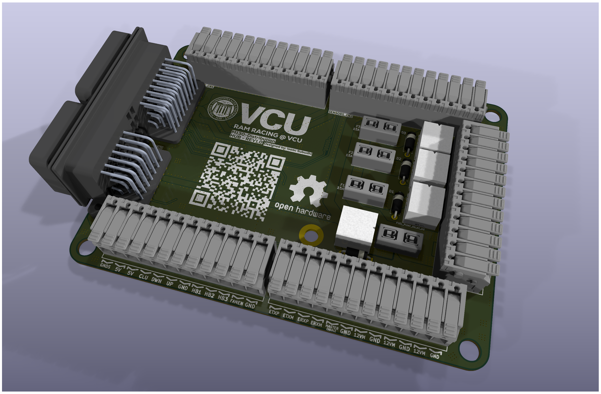

# M130-Distribution-HUB

[](https://ohwr.org/cern_ohl_p_v2.txt)
[](https://www.kicad.org/)
[](https://github.com/WindingMotor/M130-Distribution-HUB)
[](https://www.fsaeonline.com/)

## Overview



The M130-Distribution-HUB provides centralized power distribution, relay control, and sensor interfacing for MoTeC M130 ECU-equipped race vehicles. Designed for Formula SAE competition with the Yamaha WR450F engine.

### Key Features

- **Direct MoTeC M130 Integration**: SuperSeal 34-pin and 26-pin connectors
- **4-Layer PCB Design**: Dual solid ground planes with optimized power distribution
- **Relay-Switched Outputs**: 4x automotive-grade SPDT relays with flyback protection
- **Individual Circuit Protection**: ATM fuse holders on each relay
- **Phoenix Contact Terminals**: Organized sensor and harness connection points
- **5V Power from MoTeC**: Eliminates need for external voltage regulation
- **FSAE Compliant**: Master shutdown relay, individual fusing, clear labeling

## Specifications

| Parameter | Value |
|-----------|-------|
| PCB Layers | 4 (Signal, GND, GND, Signal) |
| Copper Weight | 1oz (35µm) (On each layer) |
| Board Dimensions | ~120mm x 90mm |
| Max Continuous Current | 40A (Across all relays) |
| Operating Voltage | 12V nominal (8-16V range) |
| Relay Coil Voltage | 12V DC |
| Fuse Protection | ATM blade fuses (15-30A) |
| Operating Temperature | -40°C to +95°C |
| Connector Count | 2x SuperSeal, 6x Phoenix Contact |

## PCB Component BOM

| Reference | Component | Part Number | Value | Package | Quantity |
|-----------|-----------|-------------|-------|---------|----------|
| U1, U2, U3, U4 | Automotive Relay | BARK-S-112DM | 12V SPDT | Custom | 4 |
| D1, D2, D3, D4 | Flyback Diode | 1N5399 | 1.5A/1000V | DO-15 | 4 |
| F1, F2, F3, F4 | Fuse Holder | FUSE_3568 | ATM | Custom | 4 |
| CN0 | SuperSeal Connector | 6437288-3 | 34-pin + 2-pin | Custom | 1 |
| CN1-CN5 | Terminal Block | Phoenix 1190310 | 12-pos | Custom | 6 |

*Note: Fuses (15-30A ATM) not included on PCB -> user-supplied based on load requirements.*

## Relay Output Assignments

| Relay | Function | Typical Fuse Rating | Connected Load |
|-------|----------|---------------------|----------------|
| U1 | Master Relay | 30A | Main power distribution |
| U2 | Fuel Pump Relay | 15A | Fuel pump (WR450F) |
| U3 | Lights Relay | 10A | Extra / running lights |
| U4 | Radiator Fan Relay | 15A | Engine cooling fan |

## Power Distribution

The PCB receives 12V battery & alternator power and distributes it through relay-switched outputs with individual fusing:

```
12V_BATT → Master Relay → 12V_OUT_MASTER_RELAY → Individual Load Relays → Fused Outputs
                                                → Fuel Pump
                                                → Lights
                                                → Radiator Fan
```

**5V Power**: Supplied directly from MoTeC M130 ECU 5V sensor output (no onboard regulation required). (Has dual 5V outputs at 1A Max)

## Design Features

- **Via Stitching**: Comprehensive thermal and EMI management with 4-layer stitched vias on high-current relay zones
- **Dual Ground Planes**: Solid inner layers for signal integrity and low-impedance return paths
- **Differential Pair Routing**: For CAN bus and Ethernet
- **Universal Teardrops**: PCB designed fir vibration resistance for motorsports environments
- **EMI Shielding**: Grounding via fence between high-power traces and sensitive signals
- **Conformal Coating Ready**: PCB accommodates post assembly coating for extra environmental protection

## Assembly Notes

1. **Relay Orientation**: Ensure pin 1 alignment with PCB silkscreen markings
2. **Flyback Diode Polarity**: Cathode (banded end) toward relay coil positive terminal
3. **Fuse Selection**: Size fuses per load requirements (5-30A ATM blade)
4. **Conformal Coating**: Apply MG Chemicals 422B or equivalent after assembly
5. **Mounting**: Use rubber grommets at mounting holes for vibration isolation

## Usage

1. Connect MoTeC M130 ECU via 34-pin and 26-pin SuperSeal connectors
2. Wire battery 12V and alternator 12V to main power terminals
3. Install appropriate ATM fuses in each holder per load requirements
4. Connect sensors to Phoenix Contact terminal blocks
5. Wire relay outputs to vehicle loads (fuel pump, lights, fan)
6. Configure MoTeC M130 relay enable outputs (digital outputs)

## Testing

Before vehicle installation:
- **Continuity Check**: Verify all power and ground nets
- **Isolation Test**: Confirm >10MΩ resistance between power and ground
- **Relay Function**: Enable each relays coil, verify contact closure with multimeter
- **Fuse Ratings**: Confirm proper fuse installation for each circuit

## License

This project is licensed under the **CERN Open Hardware Licence Version 2 - Permissive** (CERN-OHL-P-2.0).

You are free to:
- Use commercially
- Modify
- Distribute
- Use in closed source, with notice of changes

See [LICENSE](LICENSE) file for full terms.

## Credits

**Designed by**: RAM Racing @ VCU Formula SAE Team  
**Main Designer**: Isaac Subudhi  
**Target Vehicle**: Yamaha WR450F IC Engine  
**ECU Platform**: MoTeC M130  
**Design Tool**: KiCad 9.0

## Support

For technical questions or contributions, please open an issue or pull request.

***

**Disclaimer**: This design is provided as-is for educational and motorsports purposes. Users are responsible for validating the design meets their specific application requirements and safety standards.
